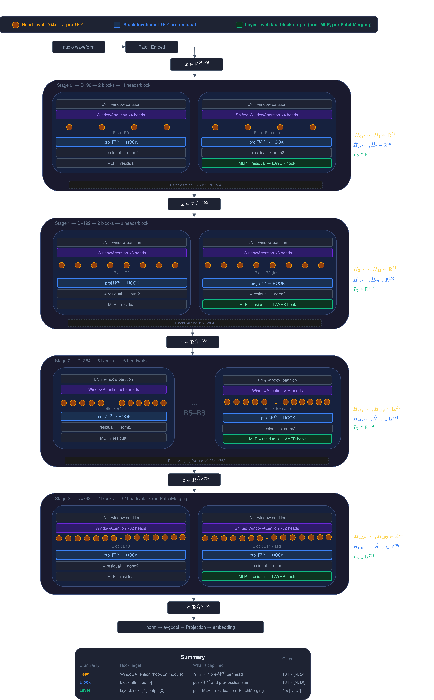
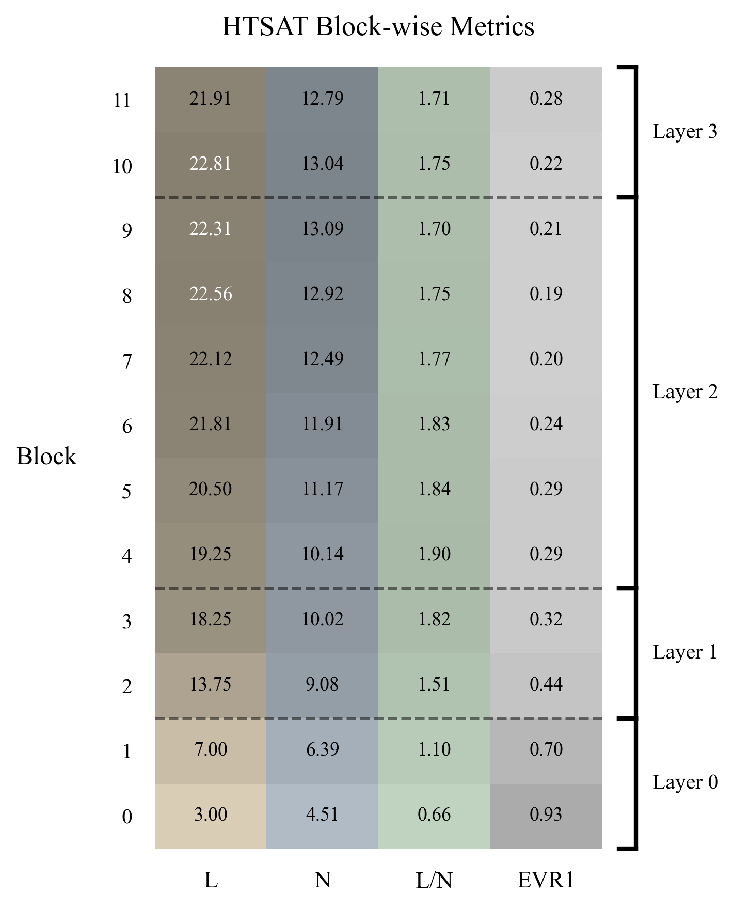
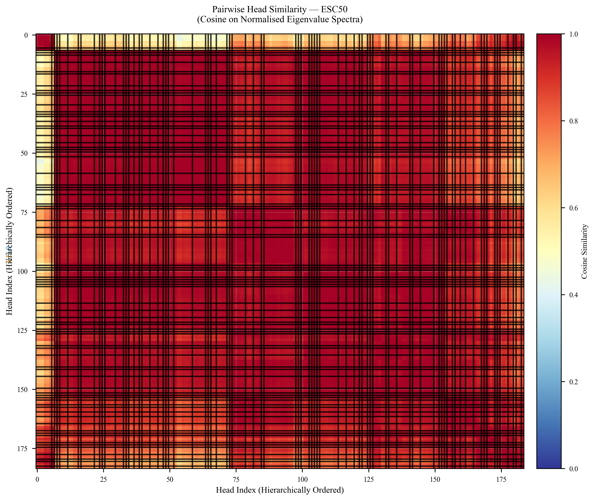
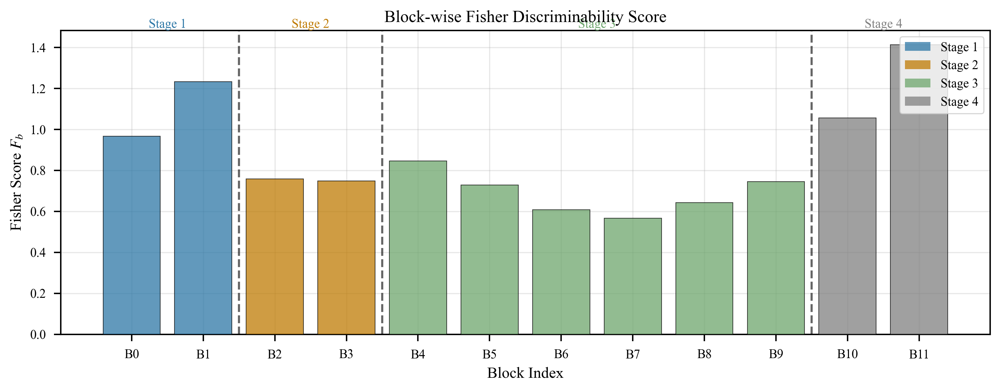

# ResiDual-CLAP

> **Status: Preliminary analysis in progress.**
> This repository documents an ongoing investigation into the internal representations of CLAP's audio encoder (HTS-AT), with the goal of designing spectral reweighting strategies — collectively referred to as **ResiDual** — to improve zero-shot downstream performance.

---

## Table of Contents

- [ResiDual-CLAP](#residual-clap)
  - [Table of Contents](#table-of-contents)
  - [Overview](#overview)
  - [Architecture: HTS-AT inside CLAP](#architecture-hts-at-inside-clap)
  - [Representation Extraction Pipeline](#representation-extraction-pipeline)
    - [Extraction Granularities](#extraction-granularities)
  - [Analysis Pipeline](#analysis-pipeline)
    - [Intrinsic Dimensionality](#intrinsic-dimensionality)
    - [Block-wise Metrics](#block-wise-metrics)
    - [Head Specialization](#head-specialization)
    - [Class-Conditional Activation \& Fisher Discriminability](#class-conditional-activation--fisher-discriminability)
  - [Datasets](#datasets)
  - [Key Results So Far](#key-results-so-far)
  - [Repository Structure](#repository-structure)
  - [Setup](#setup)

---

## Overview

CLAP (Contrastive Language–Audio Pretraining) aligns audio and text representations in a shared embedding space. Its audio encoder, **HTS-AT**, is a hierarchical Swin-Transformer with four stages of increasing embedding dimension. The final audio embedding is the result of a complex, multi-stage computation — and it is not obvious which attention heads or layers contribute the most to class-discriminative information.

**ResiDual** is a project in two phases:

1. **Analysis** — Systematically characterise the residual stream of HTS-AT by decomposing attention outputs at the head level, and measuring linear/nonlinear intrinsic dimensionality, class separability, and head specialization across all 184 heads.

2. **Adaptation** *(planned)* — Design spectral reweighting strategies that leverage this characterisation to improve downstream performance, without full fine-tuning.

---

## Architecture: HTS-AT inside CLAP

HTS-AT is a hierarchical Swin-Transformer with four stages of block depths $[2, 2, 6, 2]$ and window size $w = 8$. The number of attention heads doubles at each stage $H_\ell = 4 \cdot 2^\ell$, while the per-head dimension $d_h = 24$ stays constant, so the total embedding dimension $D_\ell = H_\ell \cdot d_h$ also doubles at each transition.

| Stage $\ell$ | Blocks $B_\ell$ | Heads $H_\ell$ | Dim $D_\ell$ | Spatial $S_\ell^2$ | Windows $N_w^\ell$ |
|:---:|:---:|:---:|:---:|:---:|:---:|
| 0 | 2 |  4 |  96 | $64\times64$ | 64 |
| 1 | 2 |  8 | 192 | $32\times32$ | 16 |
| 2 | 6 | 16 | 384 | $16\times16$ |  4 |
| 3 | 2 | 32 | 768 | $8\times8$   |  1 |

Total heads: $H_\text{tot} = 2\cdot4 + 2\cdot8 + 6\cdot16 + 2\cdot32 = 184$

CLAP's audio projection head maps the $D_3 = 768$ output to a joint embedding space of dimension $d_\text{proj} = 1024$ via a two-layer MLP with residual connection.

---

## Representation Extraction Pipeline

The core of the analysis is a **per-head residual decomposition**. Within stage $\ell$, the residual stream after block $b$ is:

$$\mathbf{Z}^{(\ell,b)} = \mathbf{Z}^{(\ell,0)} + \sum_{b'=1}^{b} \mathbf{A}_{\ell,b'} + \sum_{b'=1}^{b} \mathbf{M}_{\ell,b'}$$

The W-MSA output $\mathbf{A}_{\ell,b}$ is decomposed exactly over individual attention heads. Denoting by $W^O_{\ell,b,h} \in \mathbb{R}^{d_h \times D_\ell}$ the row slice of the output projection for head $h$:

$$\mathbf{A}_{\ell,b} = \sum_{h=1}^{H_\ell} \underbrace{\mathbf{H}_{\ell,b,h}\,W^O_{\ell,b,h} + \frac{\mathbf{b}^O_{\ell,b}}{H_\ell}}_{\widehat{\mathbf{H}}_{\ell,b,h} \;\in\; \mathbb{R}^{N_w^\ell \times M \times D_\ell}}$$

Each $\widehat{\mathbf{H}}_{\ell,b,h}$ is the *per-head projected contribution*: it lives in the full residual-stream space $\mathbb{R}^{D_\ell}$ and contributes additively to $\mathbf{Z}^{(\ell,b)}$. **The decomposition is exact.**

We then spatially mean-pool each per-head contribution to obtain one vector per audio sample:

$$\widehat{\mathbf{r}}_{\ell,b,h} = \frac{1}{N_w^\ell M} \sum_{i=1}^{N_w^\ell}\sum_{j=1}^{M} \widehat{\mathbf{H}}_{\ell,b,h}[i,j,:] \;\in\; \mathbb{R}^{D_\ell}$$

Stacking across $n$ samples gives the dataset matrix $\widehat{\mathbf{R}}_{\ell,b,h} \in \mathbb{R}^{n \times D_\ell}$, the **primary object of our analysis** (184 matrices in total).

### Extraction Granularities

Three granularities of hook-based extraction are implemented, as illustrated below:

| Granularity | Hook target | What is captured | Outputs |
|---|---|---|---|
| **Head** | `WindowAttention` (module hook) | Raw head output $\mathbf{H}_{\ell,b,h}$ then projected → $\widehat{\mathbf{H}}_{\ell,b,h}$ | $184 \times [N, 24]$ pre-proj, $184 \times [N, D_\ell]$ post-proj |
| **Block** | `block.attn` input | Pre-attention residual stream | $184 \times [N, D_\ell]$ |
| **Layer** | `layer.blocks[-1]` output | Post-MLP + residual, pre-PatchMerging | $4 \times [N, D_\ell]$ |



> **Note on cross-stage comparisons.** Because $D_\ell \in \{96, 192, 384, 768\}$ varies across stages, the ambient dimension of $\widehat{\mathbf{R}}_{\ell,b,h}$ differs between stages. The maximum number of non-trivial principal components is bounded by $\min(n, D_\ell)$, so heads at Stage 3 have a strictly larger ambient ceiling than at Stage 0. All cross-stage dimensionality comparisons must account for this varying ceiling explicitly. Within a single stage, comparisons across blocks and heads are well-defined.

---

## Analysis Pipeline

### Intrinsic Dimensionality

For each of the 184 head representation matrices $\widehat{\mathbf{R}}_{\ell,b,h}$, we compute a battery of linear and nonlinear dimensionality estimators.

**Linear estimators:**

- **PCA-based dimensionality** at thresholds $\alpha \in \{0.90, 0.95, 0.99\}$:

$$d_\text{PCA}(\alpha) = \arg\min_k\left\{\frac{\sum_{i=1}^k \lambda_i}{\sum_i \lambda_i} \geq \alpha\right\}$$

- **Explained Variance Ratio of PC1**: $\text{EVR}_1 = \lambda_1 / \sum_i \lambda_i$

- **Participation Ratio**: $\text{PR} = \left(\sum_i \lambda_i\right)^2 / \sum_i \lambda_i^2$

- **Effective Rank**: $\text{EffRank} = \exp\!\left(-\sum_i p_i \log p_i\right),\quad p_i = \lambda_i / \sum_j \lambda_j$

**Nonlinear estimators:**

- **TwoNN**: $d_\text{TwoNN} = \left(\frac{1}{n}\sum_{i=1}^n \log \frac{r_2^{(i)}}{r_1^{(i)}}\right)^{-1}$

- **MLE** (k=20): $\hat{d}_\text{MLE}(\mathbf{r}) = \left(\frac{1}{k-1}\sum_{j=1}^{k-1}\log\frac{r_k(\mathbf{r})}{r_j(\mathbf{r})}\right)^{-1}$, averaged over all samples

**Linear-Nonlinear (L/N) Ratio** — block-level diagnostic for nonlinear curvature:

$$\text{Ratio}_B = \frac{\bar{d}_{\text{PCA}_{99}}}{\bar{d}_\text{TwoNN}}$$

Values near 1 indicate near-linear manifolds; higher values signal nonlinear structure beyond what PCA captures.

**Outputs:** `panel_A` through `panel_H` (8 diagnostic plots), `htsat_block_metrics.png`



### Block-wise Metrics

Block-level aggregation averages head metrics within each block:

$$\bar{m}_B = \frac{1}{|\mathcal{H}_B|}\sum_{h \in \mathcal{H}_B} m_h$$

A summary heatmap shows $\bar{d}_\text{PCA}$, $\bar{d}_\text{TwoNN}$, L/N ratio, and $\text{EVR}_1$ across all 12 blocks, providing a global view of how representational complexity evolves through the network.

### Head Specialization

To characterize head-level diversity, we analyze **spectral fingerprints**: the explained variance curve (eigenspectrum) of each head's representation matrix $\widehat{\mathbf{R}}_{\ell,b,h}$. Heads whose eigenspectra cluster together are hypothesized to perform functionally similar computations.

- **Spectral fingerprinting**: PCA eigenspectra per head, visualized as a heatmap
- **Head similarity matrix**: pairwise cosine similarity between spectral fingerprints, with hierarchical clustering
- **Task importance analysis**: mean ablation — zeroing out one head at a time and measuring the drop in downstream zero-shot accuracy

**Outputs:** `spectral_fingerprinting.{pdf,png}`, `head_similarity_matrix.{pdf,png}`, `head_clustering.{pdf,png}` (UMAP of fingerprints)



### Class-Conditional Activation & Fisher Discriminability

To quantify how much class-discriminative information each head encodes, we compute:

**Class-conditional activation heatmap:** mean activation norm per head per class, revealing heads that respond selectively to specific categories.

**Fisher discriminability score:**

$$F_h = \frac{\text{tr}(\mathbf{S}_B)}{\text{tr}(\mathbf{S}_W)}$$

where $\mathbf{S}_B$ and $\mathbf{S}_W$ are the between-class and within-class scatter matrices of $\widehat{\mathbf{R}}_{\ell,b,h}$.

**Fisher vs. ablation correlation:** Cross-validation between Fisher scores and mean ablation importance, to assess how well the unsupervised discriminability metric predicts the functional importance of each head.

**Outputs:** `class_activation_heatmap.{pdf,png}`, `fisher_discriminability.{pdf,png}`, `fisher_vs_ablation.{pdf,png}`




All analyses are run in **two regimes**:
- **Pre-projection** (`residual_analysis_pre.ipynb`): representations in $\mathbb{R}^{D_\ell}$ before CLAP's audio projection head
- **Post-projection** (`residual_analysis_post.ipynb` / `htsat_analysis.ipynb`): representations after projection to $\mathbb{R}^{1024}$

Post-projection outputs are prefixed with `postproj_`.

---

## Datasets

Three audio classification benchmarks are used for extraction and evaluation:

| Dataset | Classes | Samples | Description |
|---|---|---|---|
| **ESC-50** | 50 | 2,000 | Environmental sounds, 5 s clips, 44.1 kHz |
| **TinySOL** | 14 | 2,071 | Orchestral instrument classes, monophonic |
| **VocalSound** | 6 | 1,200 | Non-speech vocal categories (stratified subset) |

Audio preprocessing follows the CLAP standard: 64-band log-mel spectrogram ($f_\min = 50$ Hz, $f_\max = 8000$ Hz, FFT window 1024, hop 320), padded or truncated to 7 seconds.

---

## Key Results So Far

> ⚠️ Preliminary findings — analysis ongoing.

- **Dimensionality grows with stage depth**, both linearly (PCA) and nonlinearly (TwoNN/MLE), consistent with increasing representational richness toward the final embedding.
- **High EVR₁ in early stages**: Stage 0 and 1 heads show strong PC1 dominance, suggesting low-rank, near-degenerate representations — the head output is dominated by a single direction. This diminishes in deeper stages.
- **L/N ratio identifies nonlinear heads**: Several heads in Stage 2 exhibit a high linear-to-nonlinear ratio, indicating that PCA underestimates the true intrinsic dimensionality and that the representation manifold has significant curvature.
- **Head heterogeneity within stages**: The head similarity matrix reveals distinct clusters of heads with similar spectral fingerprints, even within the same block — suggesting functional specialization beyond what block position alone predicts.
- **Fisher discriminability is concentrated in Stages 2–3**: The highest between-class/within-class ratio is found in later blocks, consistent with the expectation that class-discriminative features emerge progressively.
- **Fisher scores correlate with ablation importance** (correlation being assessed), which would validate Fisher discriminability as a cheap proxy for functional head importance without requiring per-head ablation runs.

---

## Repository Structure

```
.
├── main.py                   # Entry point for extraction runs
├── pyproject.toml
├── src/
│   ├── CLAPWrapper.py        # CLAP model wrapper with hook infrastructure
│   ├── configs/              # Dataset and model configs
│   ├── datasets/             # Dataset loaders
│   ├── models/               # Model definitions
│   ├── heads_representations/# Saved head representation matrices (HDF5/pkl)
│   ├── htsat_analysis.ipynb              # Main analysis notebook (post-projection)
│   ├── residual_analysis_pre.ipynb       # Pre-projection head analysis
│   ├── residual_analysis_post.ipynb      # Post-projection head analysis
│   ├── attention_from_datasets.ipynb     # Dataset-level attention exploration
│   └── id_df.csv                         # Cached intrinsic dimensionality results
├── report/                   # LaTeX report source
└── htsat_pipeline.md         # Detailed pipeline documentation
```

---

## Setup

This project uses [uv](https://github.com/astral-sh/uv) for dependency management.

```bash
# Install dependencies
uv sync

# Run extraction pipeline
uv run python main.py --dataset esc50 --granularity head

# Launch analysis notebooks
uv run jupyter lab src/htsat_analysis.ipynb
```

---

*For the full mathematical derivations, notation table, and architectural details, see the `report/` directory.*